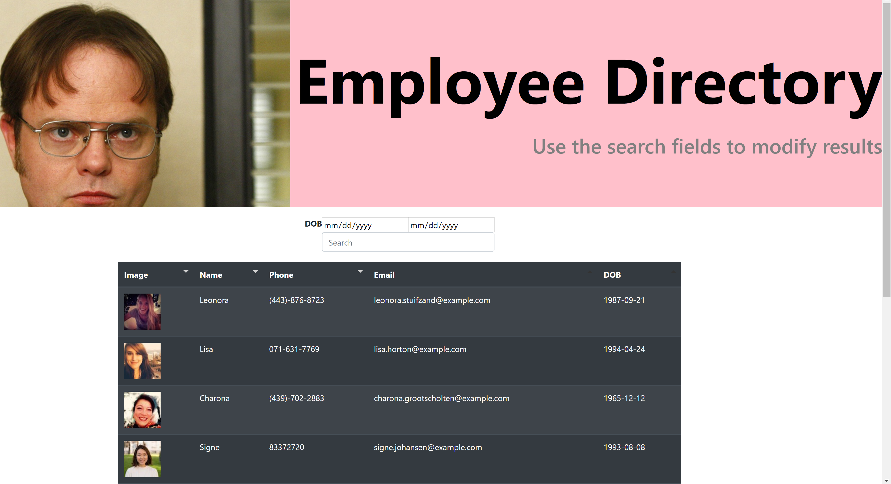

# github.io-employee-tracker

## Description

The purpose of this project is to provide a employee directory for users to search for employees using React. This project was built by break up the application's UI into components, managing component state, and responding to user events.

## User Story

```

 As a user, I want to be able to view my entire employee directory at once so that I have quick access to their information.

```
## Functionality GIF



## How It Works

* User runs 'npm install' for dependencies in the terminal
* Initiates from the command 'npm run start' in the terminal
* User is prompted with inputs for employee search
* User can selected date of birth start and end date range

## Link


https://andreathomas19460.github.io/github.io-employee-directory
 

## Status 

In progress...sorting not functioning correctly

## Author

Andrea Thomas

